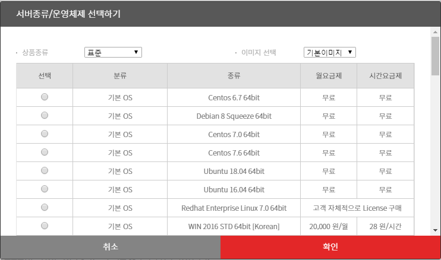
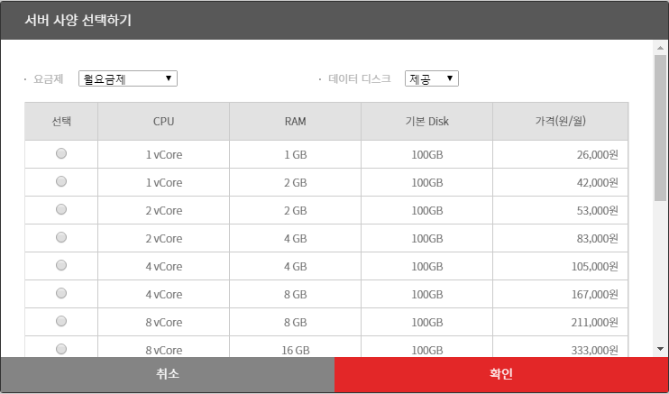
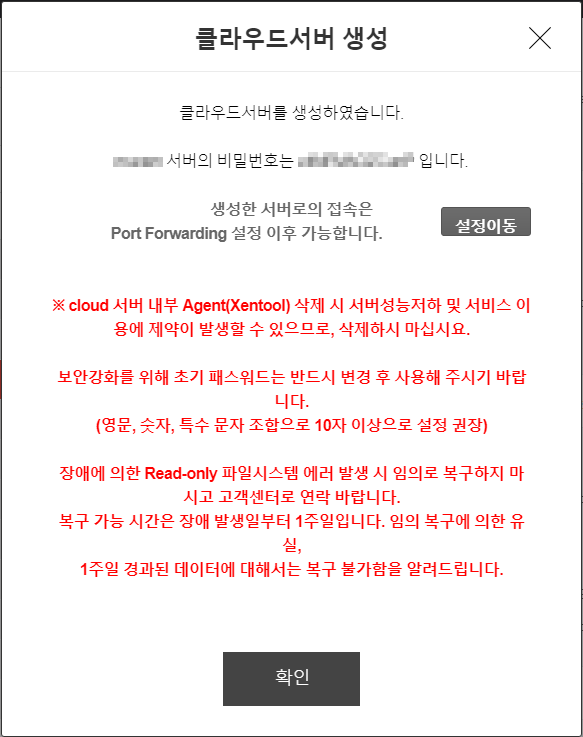
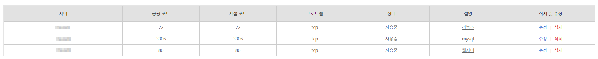

## 1. 회원 가입  
  
  
## 2. 컴퓨팅 상품 신청  
- 본인 인증 및 주소지 입력
- 결제 정보 입력
  
  
## 3. 클라우드 콘솔로 이동하여 Server -> 클라우드 서버리스트 -> 서버 생성  
### 서버명은 영문 입력 및 다른 필수 사항 입력  
  
  
### 서버 종류 및 운영체제 선택  
  

### 서버 사양에 따른 요금제 선택  
  

### 서버 생성 완료 메시지 확인  
  

## 4. 포트포워딩 설정하기  
- Server 네트워킹 메뉴 -> 포트포워딩 추가  
- 포트 추가  
    리눅스 포트 : 22  
    웹서버 포트 : 80  
    mysql 포트 : 3306    
  